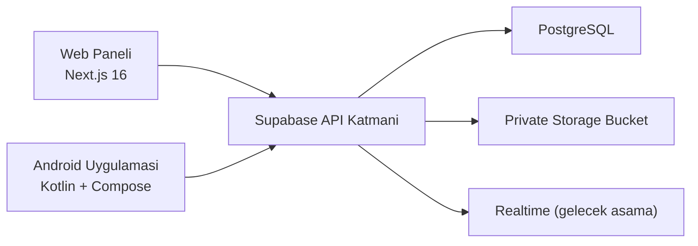

# ARCHITECTURE

## Genel Yapi

Sistem; teknik personel ve yoneticiler icin Next.js web paneli, personel ve saha kullanimlari icin Android uygulamasi ve Supabase tabanli veri/auth altyapisindan olusur.

## Katmanlar

### Web

- Supabase SSR auth yapisi kullanir.
- Login, logout, protected layout ve role guard server-side calisir.
- `/dashboard` ve `/tickets` yalnizca `technician` ve `admin` rollerine aciktir.
- `employee` rolundeki kullanici web paneline alinmaz ve `access-denied` ekranina yonlendirilir.

### Android

- Android uygulamasi halen prototip katmanindadir.
- `assembleDebug` dogrulamasi korunmustur.
- Supabase auth ve veri baglantisi sonraki asamaya birakilmistir.

### Supabase

- PostgreSQL semasi SQL migration dosyalari ile hazirlanmistir.
- Ana enumlar, dokuz ana tablo, trigger fonksiyonlari ve helper function'lar tanimlanmistir.
- RLS policy taslagi migration seviyesinde olusturulmustur.
- `ticket-attachments` private storage bucket migrationi hazirdir.
- Seed dosyasi yalnizca kurgusal departman ve cihaz referans verisi uretir.

## Auth ve Yetkilendirme Akisi

1. `src/proxy.ts`, auth cookie'lerini yenilemek ve temel oturum kontrolunu yapmak icin her protected istekte calisir.
2. Server component ve server action'lar `@supabase/ssr` ile server client olusturur.
3. `auth.getUser()` ile dogrulanmis kullanici okunur.
4. `public.profiles` tablosundan rol, aktiflik ve birim bilgisi cozumlenir.
5. Protected layout, employee veya pasif profilleri web paneline almaz.
6. Ticket listesi ve sayaçlar service role kullanmadan, mevcut publishable key + user session ile sorgulanir.

## Mevcut Supabase Gercegi

- Migration dosyalari, RLS ve storage katmani hazir durumdadir.
- Web ve Android istemci baglantilari asamali olarak kurulmustur; web tarafinda SSR auth katmani eklendi.
- Runtime RLS guvenligi, yerel `supabase db reset` ve gercek session testleri tamamlanmadan guvenli kabul edilmez.
- 2026-07-06 tarihinde Docker engine erisimi olmadigi icin yerel migration reset kapisi gecilememistir.

## Guvenlik Kararlari

- Service role key istemci tarafina verilmez.
- Cookie veya localStorage icindeki role degerine guvenilmez.
- Rol her zaman `profiles.role` alanindan okunur.
- `middleware.ts` yerine Next.js 16 uyumlu `src/proxy.ts` kullanilir.
- Uzak Supabase migration uygulamasi, yerel reset ve seed dogrulamasi tamamlanmadan baslatilmaz.
