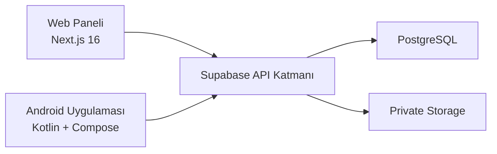

# ARCHITECTURE

## Genel Yapı

Sistem üç ana katmandan oluşur:

1. Next.js tabanlı web yönetim paneli
2. Kotlin/Compose tabanlı Android istemcisi
3. Supabase tabanlı veri, auth ve güvenlik katmanı

## Web Katmanı

Web panel, teknik personel ve yöneticiler için hazırlanmıştır.

Tamamlanan ana sorumluluklar:

- SSR auth ve oturum yenileme
- Role guard
- Dashboard
- Ticket listeleme, detay, atama, durum ve yorum akışları
- Device listeleme, detay, create, edit, passive
- Maintenance records
- Güvenli QR preview

Web tarafında `employee` rolü yönetim paneline alınmaz ve `access-denied` ekranına yönlendirilir.

## Android Katmanı

Android uygulama katmanları düzenli biçimde ayrılmıştır:

- `core`
- `data`
- `domain`
- `feature`
- `navigation`

Bu yapı şu açıdan tutarlıdır:

- `domain` modelleri iş nesnelerini taşır
- `data` Supabase repository katmanını içerir
- `feature` ekran, state ve ViewModel katmanını toplar
- `navigation` route ve akış bağlarını yönetir

Android tarafında şu iş akışları MVP foundation seviyesinde hazırlanmıştır:

- auth foundation
- role-based home ekranları
- employee ticket list/detail/create
- technician queue
- technician status update
- ticket comment
- device list/detail
- device maintenance history
- device QR preview

## Supabase Katmanı

Supabase katmanı SQL migration tabanlıdır.

Temel bileşenler:

- enum tipleri
- 9 ana tablo
- trigger ve helper function yapısı
- RLS policy seti
- private storage bucket
- seed verileri
- smoke testler

Bu yapı web ve Android istemcilerinin publishable key + kullanıcı session yaklaşımıyla güvenli çalışmasını hedefler.

## Kimlik Doğrulama ve Yetkilendirme

### Web

- `src/proxy.ts` auth cookie zincirini korur
- server component ve server action tarafında `@supabase/ssr` kullanılır
- rol her zaman `public.profiles.role` üzerinden çözülür
- service role kullanılmaz

### Android

- `BuildConfig.SUPABASE_URL`
- `BuildConfig.SUPABASE_PUBLISHABLE_KEY`
- Supabase Kotlin auth/postgrest istemcisi
- role çözümleme `profiles.role` üzerinden yapılır
- pasif profil ve profile satırı olmayan kullanıcılar kontrollü hata ekranlarına yönlendirilir

## Güvenlik Kararları

- Service role veya database password istemciye verilmez.
- Cookie, localStorage veya client-side metadata içindeki role değerine güvenilmez.
- RLS kapatılmaz.
- `devices.assigned_user_id` ile `tickets.assigned_to` kavramları bilinçli olarak ayrılır.
- QR payload yalnızca `TBT-DEVICE:<qr_token>` biçiminde güvenli token içerir.

## Mevcut Mimari Durumu

Web MVP iş akışları, gerçek runtime ve RLS doğrulamalarıyla güçlü biçimde tamamlanmıştır.

Android tarafında mimari omurga ve ekran iskeletleri build güvenli biçimde tamamlanmıştır. Ancak bazı Android ekranlar employee veya technician canlı oturumuyla uçtan uca test edilemediği için dokümantasyonda foundation olarak işaretlenmiştir.
