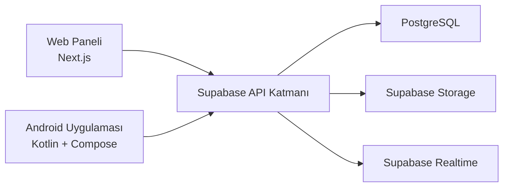

# ARCHITECTURE

## Genel İlişki

Sistem; yönetici ve teknik personel için web paneli, belediye personeli ve teknik ekip için Android uygulaması ve ileriki aşamalarda veri, dosya ve yetkilendirme altyapısı sağlayacak Supabase katmanından oluşur.

## Mimari Diyagram

## Katmanların Görevleri

### Web

- Yönetici ve teknik personel için panel deneyimi sunar
- Dashboard, talep takibi ve envanter ekranlarını barındırır
- CSS Modules ve ortak tasarım değişkenleri ile sade bir arayüz sağlar

### Android

- Mobil kullanım için hızlı erişim ekranları sunar
- Personel talep oluşturma ve teknik ekibin saha görünümü için hazırlanır
- Compose tabanlı ekran yapısı ile sonraki özelliklere zemin oluşturur

### Supabase

- İleriki aşamalarda kimlik doğrulama, veritabanı, dosya yükleme ve gerçek zamanlı veri senkronizasyonu sağlayacaktır
- Veritabanı yönetimi migration dosyaları üzerinden ilerleyecektir

## Verinin Genel Akışı

1. Kullanıcı web veya Android istemcisi üzerinden işlem başlatır.
2. İstemci, doğrulanmış istekleri Supabase API katmanına gönderir.
3. Yapılandırılmış veri PostgreSQL tablolarında tutulur.
4. Fotoğraf veya belge benzeri dosyalar Supabase Storage üzerinde saklanır.
5. Gerekli durumlarda durum değişiklikleri Realtime ile istemcilere iletilir.

## Kimlik Doğrulama İçin İleri Aşama Yaklaşımı

Bu aşamada gerçek kimlik doğrulama uygulanmamaktadır. Sonraki aşamada:

- Web ve Android istemcileri Supabase Auth ile oturum açacaktır.
- Rol bilgisi kullanıcı profili ve yetki tabloları üzerinden yönetilecektir.
- Yetkilendirme hem istemci akışlarında hem de Row Level Security politikalarında doğrulanacaktır.

## Dosya Yüklemeleri

Talep fotoğrafları ve benzeri ekler, ileriki aşamada Supabase Storage üzerinden yüklenecek ve yalnızca uygun rol ve kayıt sahiplerinin erişebileceği kurallarla korunacaktır.

## Anahtar ve Sır Ayrımı

- İstemci tarafında yalnızca publishable veya anon düzeyi güvenli anahtar kullanılmalıdır.
- Service role anahtarı yalnızca sunucu tarafı veya güvenli yönetim araçları için düşünülmelidir.
- Gerçek anahtarlar repository içine eklenmemelidir.

## Migration Tabanlı Veritabanı Yönetimi

Veritabanı şeması ve güvenlik politikaları SQL migration dosyaları ile yönetilecektir. Şema değişiklikleri doğrudan canlı ortamda değil, sürümlenebilir migration akışı ile izlenecektir.

## Android Yapılandırma Notu

Android uygulaması için ileriki aşamada gerekli olabilecek Supabase veya benzeri istemci anahtarları doğrudan kaynak kod içine yazılmamalıdır. Bunun yerine:

- `local.properties` veya Git dışı tutulan yerel yapılandırma mekanizmaları kullanılmalıdır
- Gerekirse `BuildConfig` alanları yalnızca örnek veya güvenli geliştirme değerleriyle beslenmelidir
- Gerçek üretim anahtarları bu aşamada eklenmemelidir
