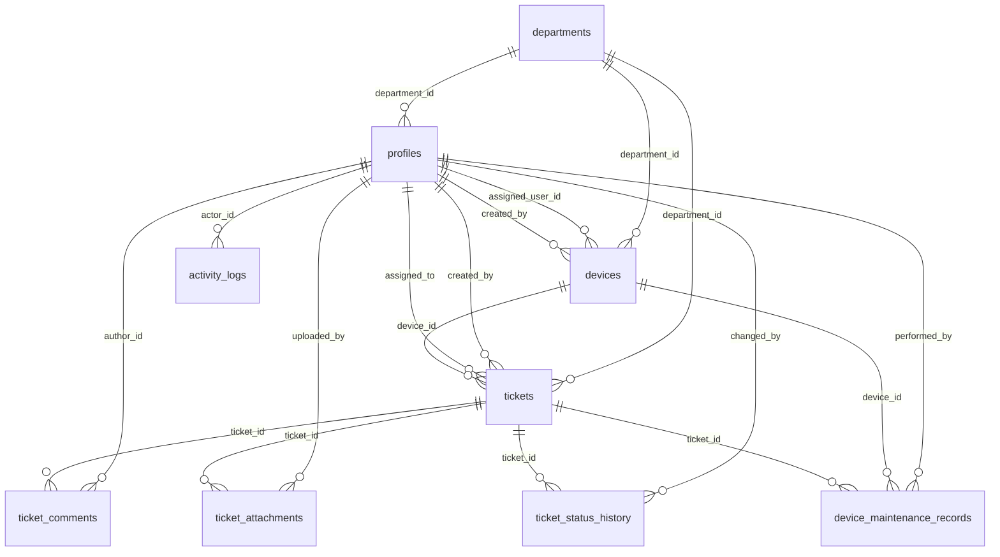

# DATABASE

## Amaç

Bu veritabanı tasarımı, Tepebaşı BT Destek prototipinin ticket yönetimi, cihaz envanteri, bakım geçmişi, yorumlar, dosya ekleri ve rol bazlı erişim gereksinimlerini migration tabanlı ve genişletilebilir bir yapıda karşılamak için hazırlanmıştır.

## Enumlar

- `app_role`: `employee`, `technician`, `admin`
- `ticket_status`: `open`, `assigned`, `in_progress`, `waiting_user`, `resolved`, `closed`, `cancelled`
- `ticket_priority`: `low`, `normal`, `high`, `urgent`
- `ticket_category`: `hardware`, `software`, `network`, `printer_scanner`, `email_account`, `access_request`, `other`
- `device_type`: `desktop`, `laptop`, `monitor`, `printer`, `scanner`, `network_device`, `tablet`, `phone`, `other`
- `device_status`: `active`, `in_repair`, `spare`, `retired`, `lost`
- `maintenance_type`: `inspection`, `repair`, `upgrade`, `component_replacement`, `software_installation`, `other`

Enum değerleri veritabanında İngilizce tutulur. Türkçe karşılıklar uygulama katmanında gösterilecektir.

## Tablolar ve Görevleri

### `departments`

Departman veya müdürlük referans verisini tutar. Silmek yerine `is_active` ile pasife alınması hedeflenir.

### `profiles`

`auth.users` ile bire bir bağlı uygulama profillerini tutar. Rol, departman ve dahili telefon bilgileri burada bulunur.

### `devices`

Kurumsal cihaz envanterini tutar. `qr_token`, seri numarasını doğrudan ifşa etmeyen ayrı bir UUID olarak saklanır.

### `tickets`

Teknik destek taleplerinin ana tablosudur. UUID birincil anahtara ek olarak kullanıcıya gösterilecek artan `ticket_number` alanı içerir.

### `ticket_comments`

Ticket üzerindeki normal ve internal yorum kayıtlarını tutar.

### `ticket_attachments`

Dosyanın kendisini değil, private bucket içindeki nesne yolunu ve metadata bilgisini saklar.

### `ticket_status_history`

Ticket durum geçişlerini append-only biçimde kaydeder.

### `device_maintenance_records`

Cihaz bakım ve arıza geçmişini tutar. Gerekirse ilgili ticket ile ilişkilendirilebilir.

### `activity_logs`

Kritik ticket ve cihaz hareketleri için hafif bir aktivite kaydı tablosudur. Secret veya dosya içeriği saklanmaz.

## İlişkiler



## Talep Durum Akışı

İzin verilen temel durum geçişleri:

- `open -> assigned`
- `open -> cancelled`
- `assigned -> in_progress`
- `assigned -> open`
- `in_progress -> waiting_user`
- `in_progress -> resolved`
- `in_progress -> assigned`
- `waiting_user -> in_progress`
- `waiting_user -> resolved`
- `resolved -> closed`
- `resolved -> in_progress`

Final durumlar:

- `closed`
- `cancelled`

Bu migration tasarımında admin için ayrı bir bypass eklenmemiştir. Tüm roller aynı veritabanı seviyesi durum geçiş kuralına uyar.

## QR Token Yaklaşımı

`devices.qr_token` alanı, doğrudan seri numarasını içermeyen benzersiz bir UUID olarak tutulur. Önerilen kullanım, QR kodun bu UUID veya ona dayalı kontrollü bir route ile çözülmesidir. Böylece fiziksel etiket üzerinden hassas cihaz bilgisi doğrudan açığa çıkmaz.

## Trigger ve Fonksiyonlar

### Ortak trigger fonksiyonları

- `set_updated_at()`: `updated_at` alanını güncelleme anında otomatik yeniler.

### Yetki ve erişim yardımcıları

- `current_user_role()`
- `is_admin()`
- `is_technician_or_admin()`
- `can_access_ticket(ticket_id uuid)`
- `can_access_device(device_id uuid)`

Bu fonksiyonlar rolü istemciden almaz; her zaman `auth.uid()` üzerinden çözer.

### İş kuralı fonksiyonları

- `validate_ticket_status_transition(...)`: izin verilen geçişleri doğrular
- `user_can_be_ticket_assignee(...)`: yalnızca aktif technician veya admin profile atanmasına izin verir
- `storage_ticket_uuid_from_path(...)`: storage object path içinden güvenli biçimde ticket UUID çıkarır

### Trigger tabanlı güvenlik ve otomasyon

- `handle_new_user()`: yeni auth kullanıcısı için profile oluşturur
- `protect_profile_mutation()`: admin dışı rol yükseltme ve kritik alan değişikliklerini engeller
- `handle_ticket_write()`: employee insert alanlarını normalize eder, assignee ve durum kurallarını doğrular, zaman damgalarını ayarlar
- `write_ticket_status_history()`: ilk kayıt ve sonraki status değişimlerinde history oluşturur
- `write_ticket_activity_log()`: kritik ticket değişimlerini hafif log tablosuna yazar
- `write_device_activity_log()`: kritik device değişimlerini loglar

## Employee Ticket Insert Güvenliği

Employee kullanıcıların `created_by`, `assigned_to`, `status`, `assigned_at`, `resolved_at` ve `closed_at` alanlarını manipüle etmesi yalnızca frontend kontrolüne bırakılmamıştır.

Seçilen yaklaşım:

1. `handle_ticket_write()` trigger fonksiyonu employee insert sırasında alanları güvenli değerlere normalize eder
2. `employees_can_create_own_tickets` RLS `with check` politikası, normalize edilmiş satırın güvenli durumda kaldığını tekrar doğrular

Bu ikili yaklaşım hem yanlış istemci verisini düzeltir hem de güvenlik kontrolünü veritabanı seviyesinde sürdürür.

## Profile Role Güvenliği

Employee veya technician bir kullanıcının kendi satırındaki `role` alanını değiştirmesi iki katmanla engellenir:

1. `users_can_update_own_profile` politikası yalnızca kendi profile satırını güncellemeye izin verir
2. `protect_profile_mutation()` trigger fonksiyonu admin dışındaki roller için `role`, `department_id` ve `is_active` alanı değişimini reddeder

Bu nedenle yalnızca UI alanını gizlemekle yetinilmemiştir.

## Storage Yaklaşımı

- Bucket adı: `ticket-attachments`
- Public erişim: `false`
- Boyut limiti: `10 MB`
- Kabul edilen örnek MIME tipleri:
  - `image/jpeg`
  - `image/png`
  - `image/webp`
  - `application/pdf`

Önerilen object path:

```text
<ticket_uuid>/<generated_file_name>
```

Storage politikaları, ilk path segmentinden ticket UUID çıkarıp `can_access_ticket(...)` ile doğrular. Geçersiz path formatı SQL hatasına değil, `null` dönerek policy reddine yol açacak biçimde tasarlanmıştır.

## Indexler

Eklenen indexler ağırlıklı olarak şu sorgular için seçildi:

- kullanıcı bazlı ticket listeleri
- atanan ticket filtreleri
- durum ve öncelik filtreleri
- departman ve cihaz ilişkili sorgular
- yorum, attachment ve history yan tablo erişimleri
- aktivite kayıtlarında `entity_type + entity_id` aramaları

Notlar:

- `asset_tag`, `qr_token` ve `ticket_number` için ayrıca unique yapı zaten index üretir
- gereksiz bileşik indexlerden kaçınıldı

## Migration Sırası

1. `20260703000100_create_enums.sql`
2. `20260703000200_create_core_tables.sql`
3. `20260703000300_create_functions_and_triggers.sql`
4. `20260703000400_enable_rls_and_policies.sql`
5. `20260703000500_create_storage.sql`

Bu sıralama; önce veri tiplerini, sonra fiziksel tabloları, ardından iş kurallarını ve en sonda güvenlik politikalarını kuracak şekilde ayrılmıştır.

## Prototip Karar Notları

- Technician kullanıcıların tüm ticket kayıtlarını okuyabilmesi prototip kullanımı ve operasyon ekranları için bilinçli olarak serbest bırakılmıştır.
- Employee kullanıcılar cihaz tarafında yalnızca kendi üzerlerine atanmış aktif kayıtları okuyabilir. Departman bazlı geniş cihaz görünürlüğü bu aşamada açılmamıştır.
- Hard delete yaklaşımı yerine `is_active` ve durum alanları tercih edilmiştir. Ticket ve device tabloları için istemci tarafında delete policy açılmamıştır.
